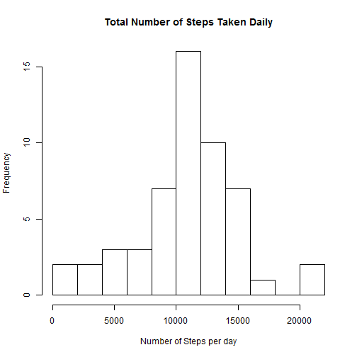
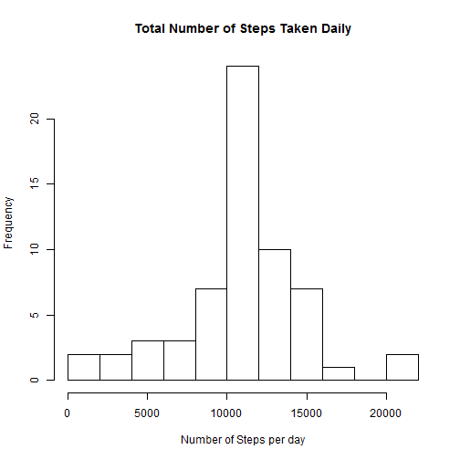
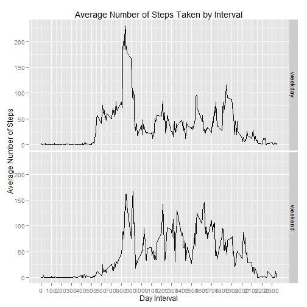

#Reproducible Research - Assignment 1

---
title: "Reproducible Research: Peer Assessment 1"
output: html_document:
keep_md: true
---

This assignment makes use of data from a personal activity monitoring device. 
This device collects data at 5 minute intervals through out the day. The data consists of two months of data from an anonymous individual collected during the months of October and November, 2012 and include the number of steps taken in 5 minute intervals each day.


## Source Data

The data for this assignment is downloaded from the course web site:

- Dataset: Activity monitoring data [52K]

- The variables included in this dataset are:

- steps: Number of steps taking in a 5-minute interval (missing values are coded as NA)

- date: The date on which the measurement was taken in YYYY-MM-DD format

- interval: Identifier for the 5-minute interval in which measurement was taken

The dataset is stored in a comma-separated-value (CSV) file and there are a total of 17,568 observations in this dataset.


##Loading and Preprocessing Data

The zip file was downloaded and unzipped in the current working directory. The filename is activity.csv.
Following steps are done to read the file and to get some understanding about the data.


```r
datafile <- read.csv("activity.csv")
nrow(datafile)
```

```
## [1] 17568
```

```r
str(datafile)
```

```
## 'data.frame':	17568 obs. of  3 variables:
##  $ steps   : int  NA NA NA NA NA NA NA NA NA NA ...
##  $ date    : Factor w/ 61 levels "2012-10-01","2012-10-02",..: 1 1 1 1 1 1 1 1 1 1 ...
##  $ interval: int  0 5 10 15 20 25 30 35 40 45 ...
```

```r
head(datafile)
```

```
##   steps       date interval
## 1    NA 2012-10-01        0
## 2    NA 2012-10-01        5
## 3    NA 2012-10-01       10
## 4    NA 2012-10-01       15
## 5    NA 2012-10-01       20
## 6    NA 2012-10-01       25
```

```r
datafile$date <- as.Date(datafile$date)
```

##What is mean total number of steps taken per day?

Create a new dataset ignoring missing data NA

```r
data <- na.omit(datafile)
summary(data)
```

```
##      steps             date               interval     
##  Min.   :  0.00   Min.   :2012-10-02   Min.   :   0.0  
##  1st Qu.:  0.00   1st Qu.:2012-10-16   1st Qu.: 588.8  
##  Median :  0.00   Median :2012-10-29   Median :1177.5  
##  Mean   : 37.38   Mean   :2012-10-30   Mean   :1177.5  
##  3rd Qu.: 12.00   3rd Qu.:2012-11-16   3rd Qu.:1766.2  
##  Max.   :806.00   Max.   :2012-11-29   Max.   :2355.0
```

Plot a histogram of the total number of steps taken each day

```r
dailysteps <- rowsum(data$steps, format(data$date, '%Y-%m-%d'))
dailysteps <- data.frame(dailysteps)
names(dailysteps) <- c("steps")
hist(dailysteps$steps, main="Total Number of Steps Taken Daily", breaks=10, xlab="Number of Steps per day")
```

 

Report the mean and median total number of steps taken per day

```r
mean(dailysteps$steps)
```

```
## [1] 10766.19
```

```r
median(dailysteps$steps)
```

```
## [1] 10765
```

##What is the average daily activity pattern?

Make a time series plot (i.e. type = "l") of the 5-minute interval (x-axis) and the average number of steps taken, averaged across all days (y-axis)


```r
library(plyr)
library(ggplot2)

interval <- ddply(data,~interval, summarise, mean=mean(steps))
qplot(x=interval, y=mean, data = interval,  geom = "line",
      xlab="5-Minute Interval",
      ylab="Number of Steps per day",
      main="Average Number of Steps Taken, Averaged Across All Days"
      )
```

 

Which 5-minute interval, on average across all the days in the dataset, contains the maximum number of steps?


```r
interval[which.max(interval$mean), ]      
```

```
##     interval     mean
## 104      835 206.1698
```

#Imputing missing values

Note that there are a number of days/intervals where there are missing values (coded as NA). The presence of missing days may introduce bias into some calculations or summaries of the data.

Calculate and report the total number of missing values in the dataset (i.e. the total number of rows with NAs)

The mean is used to fill in the missing values and a new data set is created.

Make a histogram of the total number of steps taken each day and Calculate and report the mean and median total number of steps taken per day. 


```r
library(dplyr)
sum(is.na(datafile$steps))
```

```
## [1] 2304
```

```r
filldata <- datafile %.% left_join(interval, by = "interval")
```

```
## Warning: %.% is deprecated. Please use %>%
```

```r
# create a new column with the mean values

filldata$fillSteps <- ifelse(is.na(filldata$steps), filldata$mean, filldata$steps)
filldata$steps <- NULL
filldata$mean <- NULL
colnames(filldata) <- c("interval", "date", "steps")
filldata <- filldata[, c(3, 1, 2)]

## create a new data frame with the number of steps per day using dplyr

filldailysteps <- rowsum(filldata$steps, format(filldata$date, '%Y-%m-%d'))
filldailysteps <- data.frame(filldailysteps)
names(filldailysteps) <- c("steps")
hist(filldailysteps$steps, main="Total Number of Steps Taken Daily", breaks=10, xlab="Number of Steps per day")
```

 

Do these values differ from the estimates from the first part of the assignment? What is the impact of imputing missing data on the estimates of the total daily number of steps?


```r
mean(filldailysteps$steps)
```

```
## [1] 10766.19
```

```r
median(filldailysteps$steps)
```

```
## [1] 10766.19
```

There is not much difference between the mean and median after filling the data and it is really close.

##Are there differences in activity patterns between weekdays and weekends?

- Create a new factor variable in the dataset with two levels - "weekday" and "weekend" indicating whether a given date is a weekday or weekend day.

- Make a panel plot containing a time series plot (i.e. type = "l") of the 5-minute interval (x-axis) and the average number of steps taken, averaged across all weekday days or weekend days (y-axis). 


```r
filldata$weekdayType <- ifelse(weekdays(filldata$date) %in% c("Saturday", "Sunday"), "weekend", "weekday")

fillinterval <- filldata %.% group_by(interval, weekdayType) %.% summarise(meanSteps = mean(steps, 
    na.rm = TRUE))
```

```
## Warning: %.% is deprecated. Please use %>%
```

```
## Warning: %.% is deprecated. Please use %>%
```

```r
ggplot(data = fillinterval, mapping = aes(x = interval, y = meanSteps)) + 
    geom_line() + facet_grid(weekdayType ~ .) + scale_x_continuous("Day Interval", 
    breaks = seq(min(fillinterval$interval), max(fillinterval$interval), 100)) + 
    scale_y_continuous("Average Number of Steps") + ggtitle("Average Number of Steps Taken by Interval")
```

 

There is significant difference in the activity pattern between weekdays and weekends and during specific time periods.

##Conclusion

This assignment helps us to understand processing activity data and identify the difference in the activiy patterns during weekdays and weekends. Also the power and usefulness of R markdown is demonstrated.

